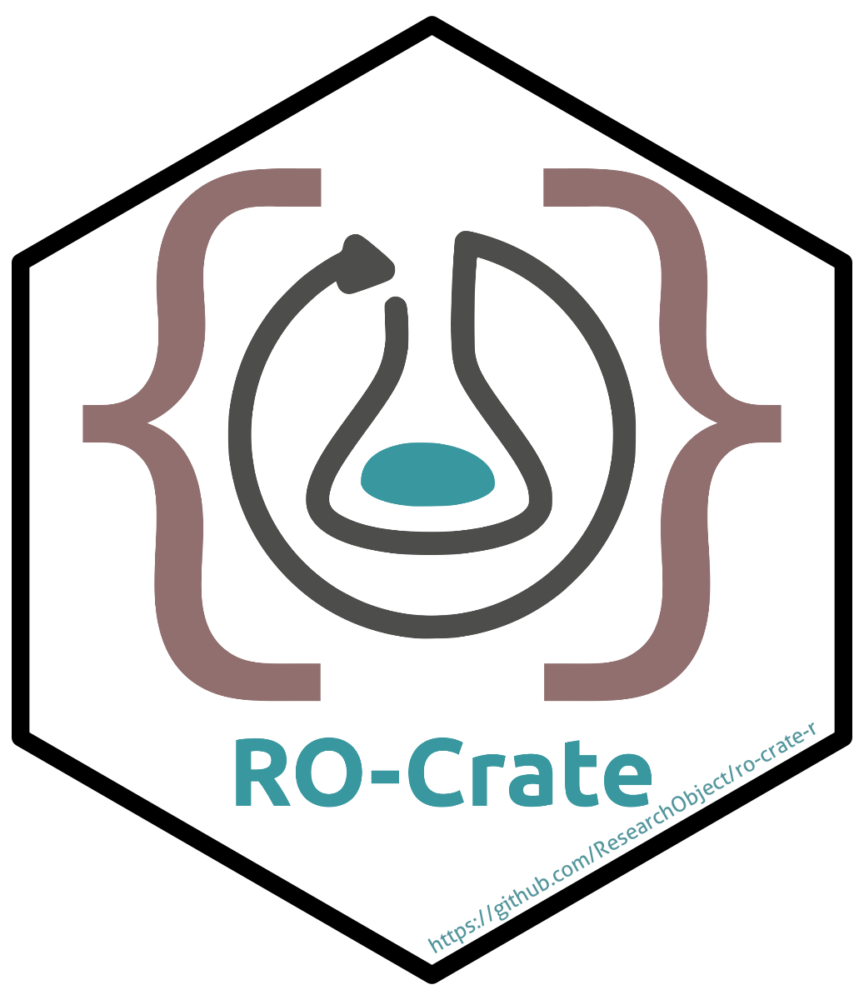

<!-- README.md is generated from README.Rmd. Please edit that file -->

# rocrateR: RO-Crate R Package Wrapper 

<!-- badges: start -->

[](https://CRAN.R-project.org/package=rocrateR)
[](https://github.com/ResearchObject/ro-crate-r/actions/workflows/R-CMD-check.yaml)
[](https://app.codecov.io/gh/ResearchObject/ro-crate-r)
<!-- badges: end -->

The goal of `{rocrateR}` is to provide an R package for creating,
manipulating and reading RO-Crates. Latest supported version of the
specification: <https://w3id.org/ro/crate/1.2/>.

#### What is an RO-Crate?

> An RO-Crate is an integrated view through which you can see an entire
> Research Object; the methods, the data, the output and the outcomes of
> a project or a piece of work. Linking all this together enables the
> sharing of research outputs with their context, as a coherent whole.
>
> RO-Crates link data and metadata no matter where they are stored – so
> that from a paper, you can find the data, and from the data, you can
> find its authors, and so on.

For more details, please visit:
<https://www.researchobject.org/ro-crate/about_ro_crate>

## 0. Installation

You can install the released version of `{rocrateR}` from
[CRAN](https://cran.r-project.org/package=rocrateR) with:

``` r
# install.packages("pak")
pak::pak("rocrateR")
```

And the development version from
[GitHub](https://github.com/ResearchObject/ro-crate-r/) with:

``` r
# install.packages("pak")
pak::pak("ResearchObject/ro-crate-r@dev")
```

## 1. Functions Overview

| Function | Purpose |
|----|----|
| `rocrate()` | Create an empty or initialized RO-Crate |
| `entity()` | Define a new entity (Person, Dataset, etc.) |
| `add_entity()` / `add_entities()` | Add entities to a crate |
| `get_entity()` | Retrieve entities by `@id` or `@type` |
| `remove_entity()` / `remove_entities()` | Remove one or more entities |
| `write_rocrate()` | Save RO-Crate to disk |
| `bag_rocrate()` / `is_rocrate_bag()` / `unbag_rocrate()` | Bagging and unbagging RO-Crates |
| `validate_rocrate()` *(planned)* | Validate RO-Crate using external Python validator |

## 2. First RO-Crate

The following command creates an RO-Crate Metadata descriptor
(`ro-crate-metadata.json`). This should be stored inside the root (`./`)
of your RO-Crate.

``` r
# library(rocrateR)
my_first_ro_crate <- rocrateR::rocrate()
```

This object is a list with the basic components of an RO-Crate. It can
be visualised in the console with the `print` command:

``` r
print(my_first_ro_crate)
#> {
#>   "@context": "https://w3id.org/ro/crate/1.2/context",
#>   "@graph": [
#>     {
#>       "@id": "ro-crate-metadata.json",
#>       "@type": "CreativeWork",
#>       "about": {
#>         "@id": "./"
#>       },
#>       "conformsTo": {
#>         "@id": "https://w3id.org/ro/crate/1.2"
#>       }
#>     },
#>     {
#>       "@id": "./",
#>       "@type": "Dataset",
#>       "name": "",
#>       "description": "",
#>       "datePublished": "2025-10-31",
#>       "license": {
#>         "@id": "http://spdx.org/licenses/CC-BY-4.0"
#>       }
#>     }
#>   ]
#> }
```

This object can be saved to disk using the following command:

``` r
my_first_ro_crate |>
  rocrateR::write_rocrate("/path/to/ro-crate/ro-crate-metadata.json")
```

For example, using a temporary directory:

``` r
tmp <- file.path(tempdir(), "ro-crate-metadata.json")
my_first_ro_crate |>
  rocrateR::write_rocrate(tmp)

# load lines / flat file
readLines(tmp)
#>  [1] "{"                                                         
#>  [2] "  \"@context\": \"https://w3id.org/ro/crate/1.2/context\","
#>  [3] "  \"@graph\": ["                                           
#>  [4] "    {"                                                     
#>  [5] "      \"@id\": \"ro-crate-metadata.json\","                
#>  [6] "      \"@type\": \"CreativeWork\","                        
#>  [7] "      \"about\": {"                                        
#>  [8] "        \"@id\": \"./\""                                   
#>  [9] "      },"                                                  
#> [10] "      \"conformsTo\": {"                                   
#> [11] "        \"@id\": \"https://w3id.org/ro/crate/1.2\""        
#> [12] "      }"                                                   
#> [13] "    },"                                                    
#> [14] "    {"                                                     
#> [15] "      \"@id\": \"./\","                                    
#> [16] "      \"@type\": \"Dataset\","                             
#> [17] "      \"name\": \"\","                                     
#> [18] "      \"description\": \"\","                              
#> [19] "      \"datePublished\": \"2025-10-31\","                  
#> [20] "      \"license\": {"                                      
#> [21] "        \"@id\": \"http://spdx.org/licenses/CC-BY-4.0\""   
#> [22] "      }"                                                   
#> [23] "    }"                                                     
#> [24] "  ]"                                                       
#> [25] "}"

# delete temporal file
unlink(tmp)
```

## 3. Including additional entities

In the previous section we created a very basic RO-Crate with the
`rocrateR::rocrate()` function; however, you are likely to include
additional entities in your RO-Crate. Entities must contain at least two
components `@id` and `@type` (see <https://w3id.org/ro/crate/1.2/> for
details).

For example, a contextual entity can be defined as follows:

``` r
# create entity for an organisation
organisation_uol <- rocrateR::entity(
  x = "https://ror.org/04xs57h96",
  type = "Organization",
  name = "University of Liverpool",
  url = "http://www.liv.ac.uk"
)

# create an entity for a person
person_rvd <- rocrateR::entity(
  x = "https://orcid.org/0000-0001-5036-8661",
  type = "Person",
  name = "Roberto Villegas-Diaz"
)
```

These two can be linked to each other via the `@id` field:

``` r
person_rvd$affiliation <- list(`@id` = organisation_uol$`@id`)
```

These entities can be attached to an RO-Crate using the
`rocrateR::add_entity()` function:

``` r
my_second_ro_crate <- rocrateR::rocrate() |>
  rocrateR::add_entity(person_rvd) |>
  rocrateR::add_entity_value(id = "./", key = "author", value = list(`@id` = person_rvd$`@id`)) |>
  rocrateR::add_entity(organisation_uol)
```

Alternatively, the same result can be achieved with the following code:

``` r
my_second_ro_crate <- rocrateR::rocrate(person_rvd, organisation_uol) |>
  rocrateR::add_entity_value(id = "./", key = "author", value = list(`@id` = person_rvd$`@id`))
```

``` r
print(my_second_ro_crate)
#> {
#>   "@context": "https://w3id.org/ro/crate/1.2/context",
#>   "@graph": [
#>     {
#>       "@id": "ro-crate-metadata.json",
#>       "@type": "CreativeWork",
#>       "about": {
#>         "@id": "./"
#>       },
#>       "conformsTo": {
#>         "@id": "https://w3id.org/ro/crate/1.2"
#>       }
#>     },
#>     {
#>       "@id": "./",
#>       "@type": "Dataset",
#>       "name": "",
#>       "description": "",
#>       "datePublished": "2025-10-31",
#>       "license": {
#>         "@id": "http://spdx.org/licenses/CC-BY-4.0"
#>       },
#>       "author": {
#>         "@id": "https://orcid.org/0000-0001-5036-8661"
#>       }
#>     },
#>     {
#>       "@id": "https://orcid.org/0000-0001-5036-8661",
#>       "@type": "Person",
#>       "name": "Roberto Villegas-Diaz",
#>       "affiliation": {
#>         "@id": "https://ror.org/04xs57h96"
#>       }
#>     },
#>     {
#>       "@id": "https://ror.org/04xs57h96",
#>       "@type": "Organization",
#>       "name": "University of Liverpool",
#>       "url": "http://www.liv.ac.uk"
#>     }
#>   ]
#> }
```

## 4. Wrangle RO-Crate

Previously, we covered how to include additional entities, other valid
operations are to extract (`rocrateR::get_entity()`) and remove
(`rocrateR::remove_entities()`).

### 4.1. Set up

``` r
# create basic RO-Crate
basic_ro_crate <- rocrateR::rocrate()

# create some entities for a project and datasets
dataset_entities <- seq_len(5) |>
  lapply(\(x) rocrateR::entity(x, type = "Dataset", name = paste0("Data ", x)))
project_entity <- rocrateR::entity(
  "#proj101", 
  type = "Project", 
  name = "Project 101",
  hasPart = dataset_entities |>
      lapply(\(x) list(`@id` = x[["@id"]]))
  )

# add project and entities to the RO-Crate
basic_ro_crate <- basic_ro_crate |>
  rocrateR::add_entity(project_entity) |>
  # note that here we are using `rocrateR::add_entities` and `rocrateR::add_entity`
  rocrateR::add_entities(dataset_entities)
#> Adding entity with @id='1'...
#> Adding entity with @id='2'...
#> Adding entity with @id='3'...
#> Adding entity with @id='4'...
#> Adding entity with @id='5'...

print(basic_ro_crate)
#> {
#>   "@context": "https://w3id.org/ro/crate/1.2/context",
#>   "@graph": [
#>     {
#>       "@id": "ro-crate-metadata.json",
#>       "@type": "CreativeWork",
#>       "about": {
#>         "@id": "./"
#>       },
#>       "conformsTo": {
#>         "@id": "https://w3id.org/ro/crate/1.2"
#>       }
#>     },
#>     {
#>       "@id": "./",
#>       "@type": "Dataset",
#>       "name": "",
#>       "description": "",
#>       "datePublished": "2025-10-31",
#>       "license": {
#>         "@id": "http://spdx.org/licenses/CC-BY-4.0"
#>       }
#>     },
#>     {
#>       "@id": "#proj101",
#>       "@type": "Project",
#>       "name": "Project 101",
#>       "hasPart": [
#>         {
#>           "@id": 1
#>         },
#>         {
#>           "@id": 2
#>         },
#>         {
#>           "@id": 3
#>         },
#>         {
#>           "@id": 4
#>         },
#>         {
#>           "@id": 5
#>         }
#>       ]
#>     },
#>     {
#>       "@id": 1,
#>       "@type": "Dataset",
#>       "name": "Data 1"
#>     },
#>     {
#>       "@id": 2,
#>       "@type": "Dataset",
#>       "name": "Data 2"
#>     },
#>     {
#>       "@id": 3,
#>       "@type": "Dataset",
#>       "name": "Data 3"
#>     },
#>     {
#>       "@id": 4,
#>       "@type": "Dataset",
#>       "name": "Data 4"
#>     },
#>     {
#>       "@id": 5,
#>       "@type": "Dataset",
#>       "name": "Data 5"
#>     }
#>   ]
#> }
```

### 4.2. Extract entity

We can extract entities via the `@id`, `@type` or both:

#### 4.2.1. Extract using `@id`

``` r
basic_ro_crate_project <- basic_ro_crate |>
  rocrateR::get_entity(id = "#proj101")

print(basic_ro_crate_project)
#> [[1]]
#> RO-Crate entity:
#>  @id = '#proj101'
#>  @type = 'Project'
```

#### 4.2.2. Extract using `@type`

``` r
basic_ro_crate_datasets <- basic_ro_crate |>
  rocrateR::get_entity(type = "Dataset")

print(basic_ro_crate_datasets)
#> [[1]]
#> RO-Crate entity:
#>  @id = './'
#>  @type = 'Dataset'
#> 
#> [[2]]
#> RO-Crate entity:
#>  @id = '1'
#>  @type = 'Dataset'
#> 
#> [[3]]
#> RO-Crate entity:
#>  @id = '2'
#>  @type = 'Dataset'
#> 
#> [[4]]
#> RO-Crate entity:
#>  @id = '3'
#>  @type = 'Dataset'
#> 
#> [[5]]
#> RO-Crate entity:
#>  @id = '4'
#>  @type = 'Dataset'
#> 
#> [[6]]
#> RO-Crate entity:
#>  @id = '5'
#>  @type = 'Dataset'
```

#### 4.2.3. Extract using `@id` and `@type`

``` r
basic_ro_crate_dataset_root <- basic_ro_crate |>
  rocrateR::get_entity(id = "./", type = "Dataset")

print(basic_ro_crate_dataset_root)
#> [[1]]
#> RO-Crate entity:
#>  @id = './'
#>  @type = 'Dataset'
```

### 4.3. Remove entity

Similarly, we can remove entities from an RO-Crate:

#### 4.3.1. Remove using scalar `@id`

``` r
basic_ro_crate_alt <- basic_ro_crate |>
  rocrateR::remove_entity("#proj101")
#> Removing the entity with @id = '#proj101'.
```

#### 4.3.2. Remove using `entity` object

``` r
basic_ro_crate_alt <- basic_ro_crate |>
  rocrateR::remove_entity(project_entity)
#> Removing the entity with @id = '#proj101'.
```

#### 4.3.3. Remove multiple entities

``` r
basic_ro_crate_alt <- basic_ro_crate |>
  rocrateR::remove_entities(dataset_entities)
#> Removing the entity with @id = '1'.
#> Removing the entity with @id = '2'.
#> Removing the entity with @id = '3'.
#> Removing the entity with @id = '4'.
#> Removing the entity with @id = '5'.
```

## 5. Create an RO-Crate Bag

Here we will explore the BagIt file packaging format, which is the
recommended to use for *bagging* RO-Crates. BagIt is described in [RFC
8493](https://doi.org/10.17487/RFC8493):

> \[BagIt is\] … a set of hierarchical file layout conventions for
> storage and transfer of arbitrary digital content. A “bag” has just
> enough structure to enclose descriptive metadata “tags” and a file
> “payload” but does not require knowledge of the payload’s internal
> semantics. This BagIt format is suitable for reliable storage and
> transfer.

In this package, the function `rocrateR::bag_rocrate` will take either a
`path` pointing to the root of an RO-Crate (must have at least an
RO-Crate metadata descriptor file, `ro-crate-metadata.json`) or an
RO-Crate object created with `rocrateR::rocrate` (and alternatives), as
shown in step 1.

For more details, run the following command:

``` r
?rocrateR::bag_rocrate
```

### 5.1. `rocrateR::bag_rocrate()`

Here we will create an RO-Crate bag inside temporary directory:

``` r
# create basic RO-Crate
basic_ro_crate <- rocrateR::rocrate()

# create temporary directory
tmp_dir <- file.path(tempdir(), paste0("rocrate-", digest::digest(Sys.time())))
dir.create(tmp_dir, showWarnings = FALSE, recursive = TRUE)

# then, we can create the RO-Crate bag
path_to_rocrate_bag <- basic_ro_crate |>
  rocrateR::bag_rocrate(path = tmp_dir)
#> RO-Crate successfully 'bagged'!
#> For details, see: /var/folders/59/4_l6kbyj2qsczmk2b52qg_f40000gn/T//RtmpOQ9QWd/rocrate-c7e0ace051a85c6d81998344a058a520/rocrate-379419d26e8b361a43544fa851839839.zip
```

### 5.2. `rocrateR::is_rocrate_bag()`

We can use the function `rocrateR::is_rocrate_bag()` to verify that a
given path points to a ZIP file or a directory with a valid RO-Crate
bag. The expected files are

- `bagit.txt` with the BagIt
  [https://www.rfc-editor.org/rfc/rfc8493.html#section-2.2.2](definition)
- `data` directory with
  [https://www.rfc-editor.org/rfc/rfc8493.html#section-2.1.2](payload)
  of the RO-Crate
- `manifest-[algorithm].txt` with the checksum for each file inside the
  `data` directory; .

``` r
basic_ro_crate_contents <- path_to_rocrate_bag |>
  rocrateR::is_rocrate_bag()
#> Valid RO-Crate found!
```

And then, the RO-Crate can be displayed

``` r
print(basic_ro_crate_contents)
#> {
#>   "@context": "https://w3id.org/ro/crate/1.2/context",
#>   "@graph": [
#>     {
#>       "@id": "ro-crate-metadata.json",
#>       "@type": "CreativeWork",
#>       "about": {
#>         "@id": "./"
#>       },
#>       "conformsTo": {
#>         "@id": "https://w3id.org/ro/crate/1.2"
#>       }
#>     },
#>     {
#>       "@id": "./",
#>       "@type": "Dataset",
#>       "name": "",
#>       "description": "",
#>       "datePublished": "2025-10-31",
#>       "license": {
#>         "@id": "http://spdx.org/licenses/CC-BY-4.0"
#>       }
#>     }
#>   ]
#> }
```

### 5.3. `rocrateR::unbag_rocrate()`

We can explore the contents of the RO-Crate bag with the following
commands:

``` r
# extract files in temporary directory
path_to_rocrate_bag_contents <- path_to_rocrate_bag |>
  rocrateR::unbag_rocrate(output = file.path(tmp_dir, "ROC"))
#> RO-Crate bag successfully extracted! For details, see:
#> /var/folders/59/4_l6kbyj2qsczmk2b52qg_f40000gn/T//RtmpOQ9QWd/rocrate-c7e0ace051a85c6d81998344a058a520/ROC

# create tree with the files
fs::dir_tree(path_to_rocrate_bag_contents)
#> /var/folders/59/4_l6kbyj2qsczmk2b52qg_f40000gn/T//RtmpOQ9QWd/rocrate-c7e0ace051a85c6d81998344a058a520/ROC/rocrate-379419d26e8b361a43544fa851839839
#> ├── bagit.txt
#> ├── data
#> │   └── ro-crate-metadata.json
#> ├── manifest-sha512.txt
#> └── tagmanifest-sha512.txt
```

``` r
# delete temporary directory
unlink(tmp_dir, recursive = TRUE, force = TRUE)
```

## 6. Validation (experimental)

As you develop your RO-Crates, you might want to validate them. There
are few validators online (some of which can be found at
<https://www.researchobject.org/ro-crate/tools>), here we will explore
the Python package
[`rocrate-validator`](https://github.com/crs4/rocrate-validator). For
installation details, please visit
<https://github.com/crs4/rocrate-validator>.

⚠️ The validation workflow depends on Python’s
[`rocrate-validator`](https://github.com/crs4/rocrate-validator). Ensure
you have a working Python installation and
[`{reticulate}`](https://cran.r-project.org/package=reticulate)
configured correctly (`reticulate::py_config()`). On Windows, you may
need to restart R after installation.

### 6.1. Install [`{reticulate}`](https://cran.r-project.org/package=reticulate)

``` r
pak::pkg_install("reticulate")
```

### 6.2. Install [`rocrate-validator`](https://github.com/crs4/rocrate-validator)

``` r
reticulate::py_install("roc-validator", env = "rocrateR")
```

### 6.3. Create example RO-Crate and validate it

``` r
basic_ro_crate <- rocrateR::rocrate()

# store crate inside temporal directory
tmp <- file.path(tempdir(), "ro-crate-metadata.json")
basic_ro_crate |>
  rocrateR::write_rocrate(tmp)
# wrap crate into zip file (expected by validator)
tmp_zip <- paste(tmp, ".zip")
zip(tmp_zip, tmp)

# validate (note the name of the module: rocrate_validator)
reticulate::use_virtualenv("rocrateR")
rocrate_validator <- reticulate::import("rocrate_validator")
status <- rocrate_validator$utils$validate_rocrate_uri(tmp_zip)

if (status) {
  message("RO-Crate is valid!")
} else {
  message("RO-Crate is invalid!")
}
#> RO-Crate is valid!

# delete temporal files
unlink(tmp)
unlink(tmp_zip)
```
